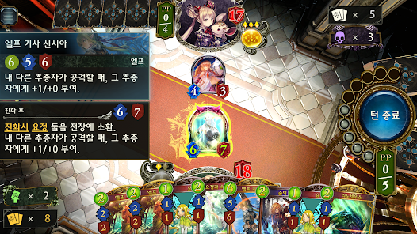
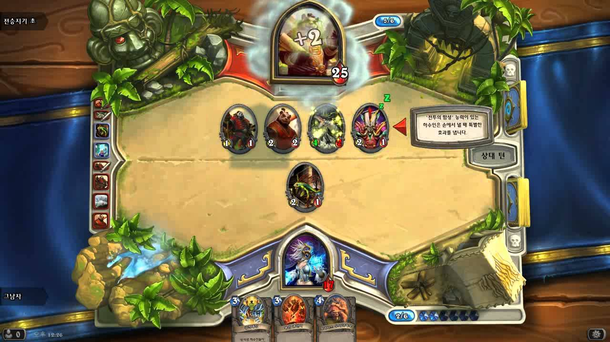
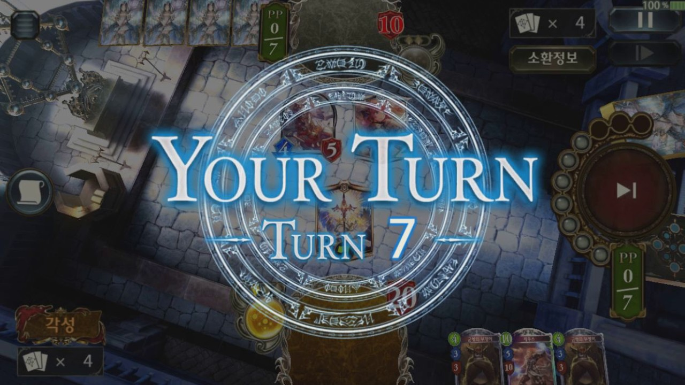
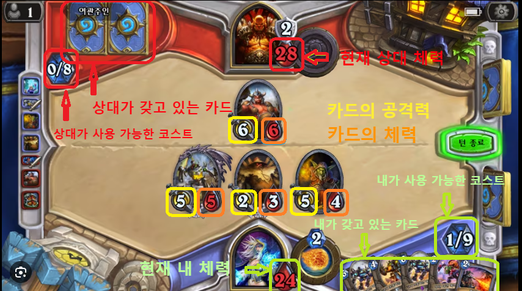

# 프로젝트명: 짭스스톤 (1988034 이종헌)

# [컨셉]

## 메인컨셉 : 카드

- 카드를 사용하며 싸우는 게임이다. 각기 다른 카드를 구경하고 직접 그 카드를 사용하며 재미를 느낄 수 있을 거라 생각했습니다.

### 서브 컨셉 1 : 순서 (카드들의 사용 순서에 따른 전략적 요소)

- 음식을 만들 때 조미료를 넣는 순서에 따라 맛이 달라지는 것처럼 카드를 사용하는 순서에 따라 전혀 다른 결과가 나타날 수 있을 것입니다.

### 서브 컨셉 2 : 운 (랜덤된 순서로 덱에서 뽑히는 카드)

- 절체절명의 순간에 카드덱에서 내가 원하는 카드를 뽑을 수도 있고 못 뽑을 수도 있을 것입니다.

### 서브 컨셉 3 : 계산 (공격력과 체력에 따라 가성비 있는 교환을 유도)

- 카드마다 공격력과 체력이 있어 계산을 통해 나 혹은 상대에게 이득이되는 다 대1교환이 성립될 것입니다.

### 서브 컨셉 4 :효과 (카드별 다양한 능력을 갖고 있음)

- 카드마다 각기 다른 능력을 갖고 있어 상대 카드에 영향을 주거나 자신의 다른 카드에 영향을 줄 수 있을 것입니다.

### 서브 컨셉 5 : 턴제 (턴제 방식으로 진행)

- 제한된 시간동안 상대방과 번갈아가며 턴을 주고 받으면서 서로 수 읽기에 재미를 느낄수 있을 것입니다.

  

# [관련 이미지 & 동영상]

- 이미지  
  
  
- 동영상
  
  

  

# [대표 이미지]

  

# [컨셉 & 대표이미지 기반 작품묘사]

> ### 대표이미지 기반 :

> ### 컨셉 기반:

  

# [<짭스스톤> 구성 요소]

- 카드를 이용해 상대방과 싸우는 턴제 카드 게임

 

## 1. 메커니즘

[도전 과제]

1. 상대방의 카드를 내 카드를 이용해 제거한다.
2. 상대방의 체력을 0으로 만든다.

[재미 요소]

1. 카드마다 공격력과 체력이 있다.
2. 카드가 필드 위로 나오거나 제거 될 때 발동되는 효과 등이 있다.
3. 데미지 계산을 통해 지능적 플레이를 할 수 있다.
4. 랜덤성이 있는 카드를 통해 자신의 운을 시험해 볼 수 있다.

 

## 2. 이야기

[만들게 된 배경]  
좋아하는 장르가 카드 게임이다 보니 직접 만들어 보고 싶었습니다.

[카메라 관점]  
게임판이 보이는 탑 뷰

 

## 3. 미적요소

[디자인][컬러]  
각기 다른 카드의 일러스트
카드가 상호작용(카드별 효과, 공격) 했을 때의 각기 다른 이펙트

[음향]  
카드가 상호작용(카드별 효과, 공격) 했을 때 각기 다른 음향 효과 
 

## 4. 기술

Unity를 활용하여 마우스를 통해 조작이 가능한 PC기반의 게임을 개발 것입니다.
