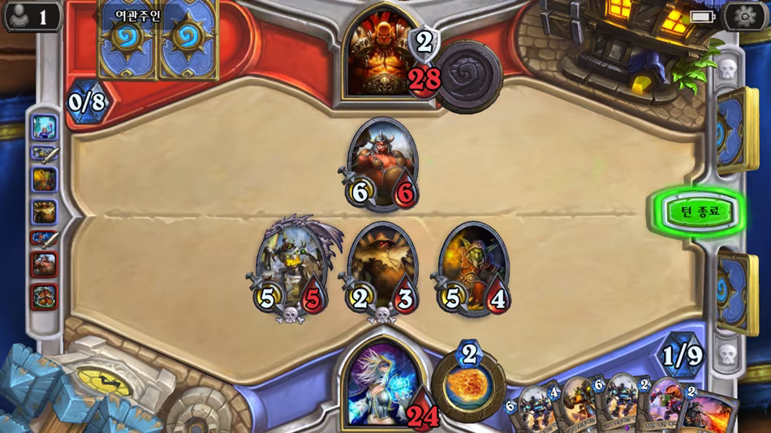

# 프로젝트명: 짭스스톤

# [컨셉]

## 메인컨셉 : 카드

- 카드를 사용하며 싸우는 게임이다. 각기 다른 카드를 구경하고 직접 그 카드를 사용하며 재미를 느낄 수 있을 거라 생각했습니다.

### 서브 컨셉 1 : 순서 (카드들의 사용 순서에 따른 전략적 요소)

- 음식을 만들 때 조미료를 넣는 순서에 따라 맛이 달라지는 것처럼 카드를 사용하는 순서에 따라 전혀 다른 결과가 나타날 수 있을 것입니다.

### 서브 컨셉 2 : 운 (랜덤된 순서로 덱에서 뽑히는 카드)

- 절체절명의 순간에 카드덱에서 내가 원하는 카드를 뽑을 수도 있고 못 뽑을 수도 있을 것입니다.

### 서브 컨셉 3 : 계산 (공격력과 체력에 따라 가성비 있는 교환을 유도)

- 카드마다 공격력과 체력이 있어 계산을 통해 나 혹은 상대에게 이득이되는 다 대1교환이 성립될 것입니다.

### 서브 컨셉 4 :효과 (카드별 다양한 능력을 갖고 있음)

- 카드마다 각기 다른 능력을 갖고 있어 상대 카드에 영향을 주거나 자신의 다른 카드에 영향을 줄 수 있을 것입니다.

### 서브 컨셉 5 : 턴제 (턴제 방식으로 진행)

- 제한된 시간동안 상대방과 번갈아가며 턴을 주고 받으면서 서로 수 읽기에 재미를 느낄수 있을 것입니다.

  

# [관련 이미지 & 동영상]

- 이미지  
  
  
- 동영상
  

  

# [대표 이미지]

  

# [컨셉 & 대표이미지 기반 작품묘사]

> ### 대표이미지 기반 :

> ### 컨셉 기반:

  

# [<게임제목> 구성 요소]

- 가나다라마바사아차카타파하 가나다라마바사아차카타파하

 

## 1. 메커니즘

[도전 과제]

1. 가나다라마바사아차카타파하
2. 가나다라마바사아차카타파하

[재미 요소]

1. 가나다라마바사아차카타파하
2. 가나다라마바사아차카타파하

 

## 2. 이야기

[만들게 된 배경]  
가나다라마바사아차카타파하 가나다라마바사아차카타파하

[카메라 관점]  
가나다라마바사아차카타파하 가나다라마바사아차카타파하

 

## 3. 미적요소

[디자인][컬러]  
가나다라마바사아차카타파하 가나다라마바사아차카타파하

[음향]  
가나다라마바사아차카타파하 가나다라마바사아차카타파하
 

## 4. 기술

가나다라마바사아차카타파하 가나다라마바사아차카타파하
